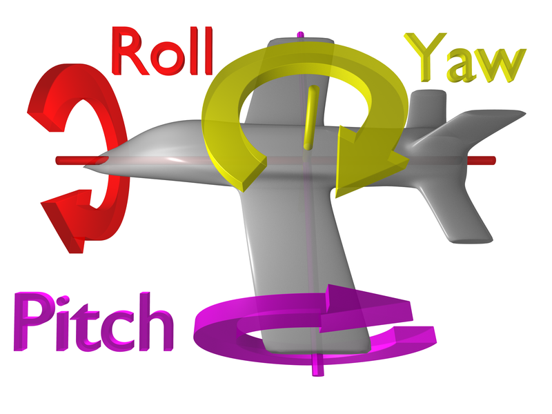
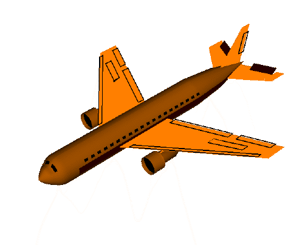
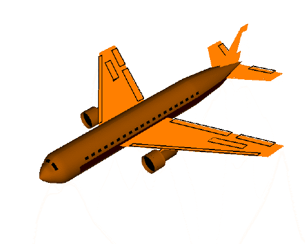
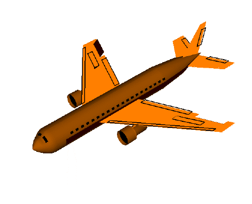

# {{ page.title }}

玩过航模，飞控的童鞋肯定需要知道 yaw, pitch and roll 的区别。这里给大家分享一下，准备要做飞控的，或者想玩三轴加速度的，或者玩了很久加速度还没研究过哪个是哪个的，可以看一下。

pitch()：俯仰，将物体绕X轴旋转（localRotationX）

yaw()：航向，将物体绕Y轴旋转（localRotationY）

roll()：横滚，将物体绕Z轴旋转（localRotationZ）

