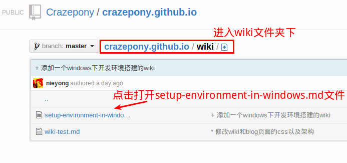
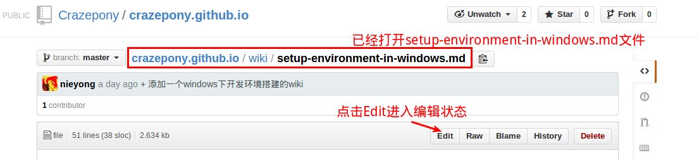
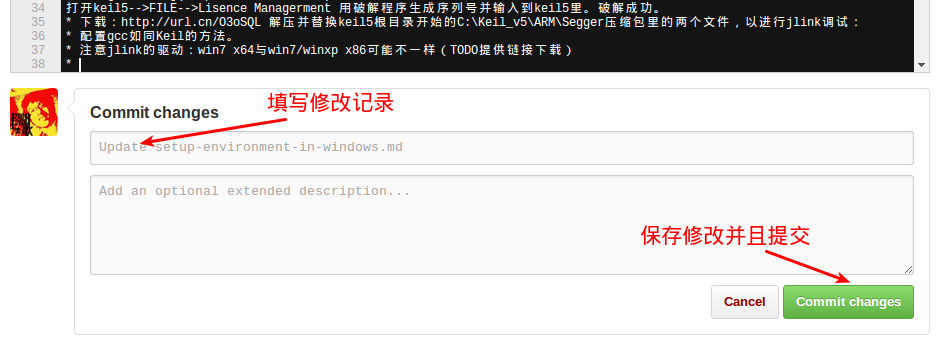

#  如何参与站点建设


## Crazepony站点
Crazepony网站包括了[Crazepony主站](http://crazepony.github.io/index-cn.html)，[Crazepony Wiki](http://crazepony.github.io/wiki.html)百科站点，[Crazepony Blog](http://crazepony.github.io/blog.html)博客站点。

Crazepony网站建设和部署使用了多种开源的技术和平台。

* 站点部署在github上，使用了github page网站服务器功能，并且整个站点框架使用[jekyll](http://jekyllrb.com/)，这是github page支持的静态网站框架。
* 前端框架使用[bootstrap](https://github.com/twbs/bootstrap)开源项目
* 百科站点和博客站点内容全部使用markdown标志语言编辑。

markdown文本解析库使用了[kramdown](http://kramdown.gettalong.org/)，该库支持的语法是markdown的一个超集，和标准markdown语法有最小的区别。[quick reference](http://kramdown.gettalong.org/quickref.html)提供了kramdown的快速入门，也可以从[syntax page](http://kramdown.gettalong.org/syntax.html)看到对kramdown支持的markdown语法一个更加详细的说明。kramdown和markdown最大的一个语法不同点，就是对代码段的注释不一样，导致原来很多地方需要修改。

> markdown的code段注释为```，而kramdown的code段注释为~~~

## Crazepony站点源码结构
Crazepony站点源代码托管在github上，点击[这里](https://github.com/Crazepony/crazepony.github.io)。由于本站点使用了jekyll框架，所以其结构基本上符合jekyll框架结构。

~~~~
├── assets              |网页相关的资源文件夹，例如图片，定制css，javascript文件等
├── dist                | bootstrap相关文件，包括css，字体，javascript
├── _layouts            | 网页模板文件，用于定义网页的header，footer等
├── wiki                | 存放wiki源文件，markdown格式
├── _posts              | 存放博客源文件，markdown格式
├── blog.html           | 博客首页
├── _config.yml         | jekyll配置文件
├── index-cn.html       | 站点首页（中文）
├── index.html          | 站点首页（英文）
├── README.md           | 本文件
└── wiki.html           | wiki首页
~~~~

修改最多的就是wiki目录和posts目录下的源文件，并且都为markdown格式。在文件最开始加入了一个特定格式的头，用于jekyll生成静态网页。

## 直接在网页上修改
参与网站wiki，blog等的建设其实很简单。对于不熟悉git/github，或者不能够本地修改的伙伴，你也可以直接到网页上进行修改。下面以修改wiki中的setup-environment-in-windows页面为例：

* 找到该网页对应的markdown文件，如上节中所属，wiki源文件都存放在wiki文件夹。

* 点击打开该文件，并且点击右侧的Edit按钮。这时候你可以编辑修改该文件，还可以点击Preview按钮预览修改效果。

* 修改结束之后，请务必协商修改的记录，然后点击Save按钮保存该文件。这个时候到网站上刷新该页面，则你的修改应该已经生效。


## 将源码下载到本地
可以将该网站源码clone到本地，进行修改调试。

~~~
//将github上的源代码clone到本地
$git clone git@github.com:Crazepony/crazepony.github.io.git

//添加修改并且上传github
$ git add .
$ git commit -m 'xxxx'
$ git pull --rebase
$ git push

~~~

## 添加新的博客

博客的源文件位于目录_posts下，并且使用markdown语法编写。添加一个新的博客只需要在该目录下添加一个新的markdown文件就可以，但是该文件的命名需要遵守下面的规则：

> 文件名必须以年-月-日开始，例如`2014-03-05-xxxx.md`。

jekyll需要根据这个文件名确定生成的静态页面的位置。和wiki不同的是并不需要在根目录下的blog.html文件中添加新增加的博客列表。


## 参考资料
markdown语法说明：

* [快速入门](http://wowubuntu.com/markdown/basic.html)
* [Markdown Basics](https://help.github.com/articles/markdown-basics)
* [GitHub Flavored Markdown](https://help.github.com/articles/github-flavored-markdown)
* [kramdown语法快速入门](http://kramdown.gettalong.org/quickref.html)，kramdown支持语法为markdown的超集，和标准markdown稍有不同
* [kramdown语法详解](http://kramdown.gettalong.org/syntax.html)，kramdown支持语法为markdown的超集

git/github入门：

* [git使用简易指南](http://www.bootcss.com/p/git-guide/)
* [沉浸式学 Git](http://igit.linuxtoy.org/index.html)

windows下的git工具：

* [Github for Windows](https://windows.github.com/)，windows下的github客户端，适合在windows下快速入手github。
* [Git for Windows](http://msysgit.github.io/)，windows下的git工具，适合上面的windows下github客户端安装不成功（经常遇到）的情况。不过需要自己配置，也适合更加深入了解git的使用。
